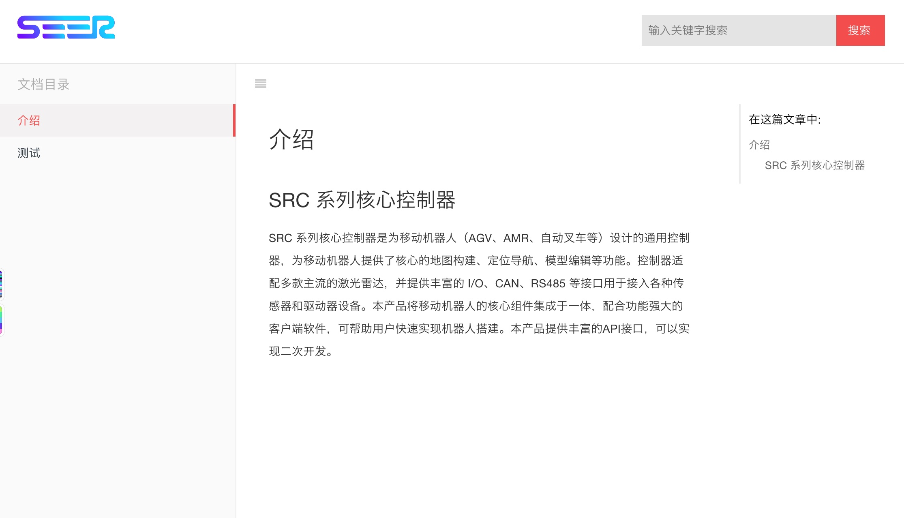

# Gitbook theme for BingoPaaS Docs



## Usage

Add the theme to your book's configuration `book.json` or `book.js`:

```json
{
    "plugins": [
        "theme-seer"
    ],
    "variables": {
        "themeSeer":{
            "nav":[
                {
                    "url":"http://www.baidu.com",
                    "target":"_blank",
                    "name": "教程"
                },
                {
                    "url":"http://www.baidu.com",
                    "target":"_blank",
                    "name": "官网"
                }
            ]
        }
    },
    "pluginsConfig": {
        "theme-seer":{
            "search-placeholder":"输入关键字搜索",
            "logo":"./logo.svg",
            "favicon": "./favicon.ico" 
        }
    }
}
```

Install by command:

``` bash
gitbook install
```

## Recommand plugins

```js
plugins: [
    '-sharing',
    "-fontsettings",
    'back-to-top-button',
    "copy-code-button",
    "cuav-chapters",
    "heading-anchors",
    "theme-seer"
    //...
]
```


Enjoy!